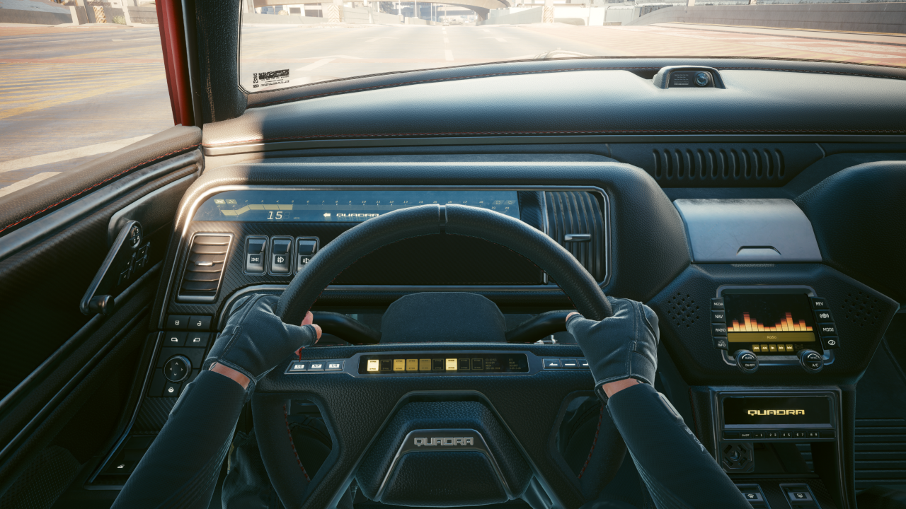

# CP77-BetterSleeves

## About

**This is a Cyberpunk 2077 mod which rolls down Sleeves.**

Are you tired of not being able to roll down your sleeves? Well, now you can!

There are currently 2 mods which already do what this mod does:
- [Sleeves (DJ_Kovrik)](https://www.nexusmods.com/cyberpunk2077/mods/3309)
  - This mod doesn't support Transmog, and a bug that was filed to the author (to report this issue) is currently marked as "Won't fix".
- [JB - Long Sleeves (Jelle Bakker)](https://www.nexusmods.com/cyberpunk2077/mods/987)
  - This one actually works with Transmog, but doesn't have filters for weapons so clipping is a thing.

Other than automatically rolling down your Sleeves (I wish this was a thing IRL), this mod adds some keybinds to do that manually.

You can add filters to `BetterSleeves.rollDownItemBlacklist` and `BetterSleeves.rollDownWeaponBlacklist` for weapons and items that you don't want to roll down sleeves for.
I may consider adding GUI text boxes to do that in-game as well as saving and loading those filters. As of now, only the names of the outfits and weapons are shown in the GUI
to be easily accessible.

### Requirements

- [CET 1.27+](https://github.com/yamashi/CyberEngineTweaks)

### Known Issues

1. The NUS Infiltrator Outfit has issues when weapons are equipped (hands are drawn on top). Either disable it or roll up sleeves when in combat.

## Development

To improve your dev experience follow the README in [libs/cet](libs/cet).
